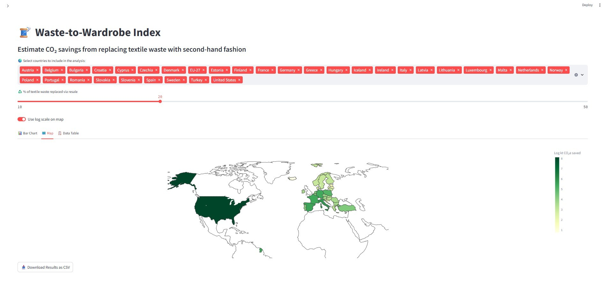

# Waste-to-Wardrobe Index

An interactive Streamlit application that estimates potential CO₂ savings by diverting textile waste into second-hand reuse. It allows users to explore, visualize, and export data on textile waste and its environmental impact across multiple countries.

---

## Overview

This app provides:

- Textile waste per capita (kg/person) by country  
- Estimates of textile waste reused under various reuse scenarios  
- Calculations of avoided CO₂ emissions (in kilotonnes)  
- Interactive visualizations including bar charts and choropleth maps  
- Editable population data per country  
- Export of results as CSV files  

---

## Data Sources

1. **Textile Waste Data**  
   - European Environment Agency (EEA)  
   - File: `data/raw/EEA_europe_waste_per_capita_2020.xlsx`  
   - Contains estimated textile waste per capita for European countries in 2020

2. **United States Data**  
   - US Environmental Protection Agency (EPA) 2018 estimate  
   - Textile waste per capita: 40.22 kg/person  

3. **Population Data**  
   - Default population figures sourced from World Bank (2020–2022)  
   - Editable via app sidebar  

4. **ISO Country Codes**  
   - Sourced from [datasets/country-codes GitHub CSV](https://github.com/datasets/country-codes)  

5. **CO₂ Savings per Resale Item**  
   - Based on studies by:  
     - Vinted & Ipsos: *Environmental Impact of Second-Hand Fashion in Europe* (2023)  
     - WRAP UK and Ellen MacArthur Foundation reports  
   - Default assumption: 1.25 kg CO₂e avoided per reused item  

---

## CO₂ Calculation Methodology

- User selects the percentage (10% to 50%) of textile waste diverted to resale  
- Assumes 1 kg of textile waste corresponds to 1 reused item  
- CO₂ avoided =  
  `(Textile Waste per Person) × (Reuse Percentage) × (Population) × (1.25 kg CO₂e per item)`  
- Results expressed in kilotonnes (kt) of avoided CO₂ emissions  

> **Note:** This model is for illustrative and educational purposes only.

---

## Features

- Multi-select country filter for tailored analysis  
- Editable population input per selected country  
- Bar chart visualization of CO₂ savings by country  
- Choropleth map with linear and logarithmic color scale options  
- Data table display with ISO country codes  
- CSV export button for downloading results  
- Responsive interface using tabs, sliders, and sidebars  

---

## Visualizations

### Example Bar Chart  


### Example Choropleth Map  


---

## Installation and Usage

1. Clone the repository:  
   ```bash
   git clone https://github.com/your-username/waste-to-wardrobe-index.git
   cd waste-to-wardrobe-index
